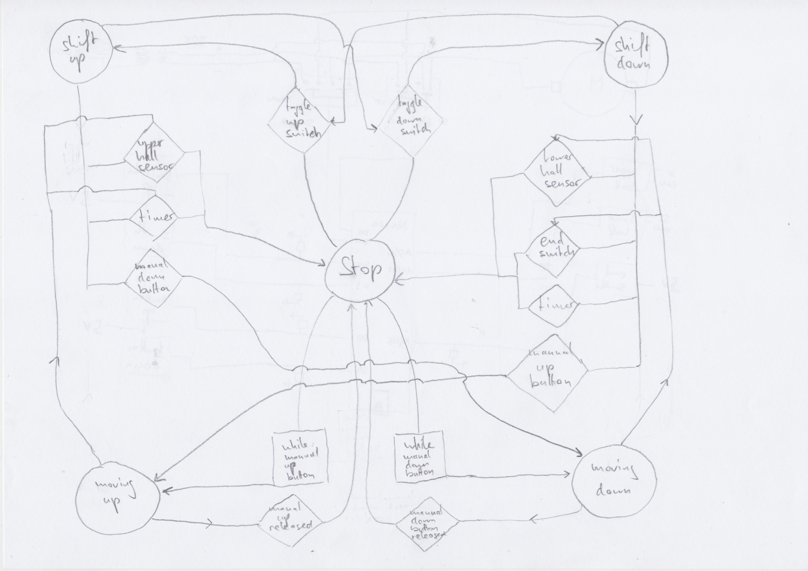
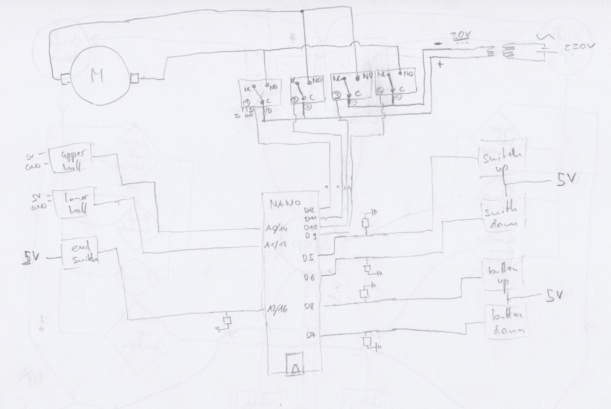

# Automating an electric standing desk
The perfect ergonomic desk solution for your prolonged home office during Covid.

### Intro
I have an electric desk that I can move from a sitting to a standing position. However I have to keep pressing a button for around 15 seconds, and then never really know exactly where to stop, since there is no top or bottom reference, except my feeling. Needless to say I decided to automate this.

### State Machine
I implemented a state machine using 5 states. Where "Moving Up/Down" is used when the buttons are manually pressed (move the table a bit) and "Shift Up/Down" is used to move the table to either the top or bottom position.

### Wiring diagram
The wiring diagram is pretty straight forward using pull down resistors where required to prevent the Arduino from getting floating / noisy input.

### Components used
- 1x electric Table (and its buttons)
- 4x [Relais](https://www.conrad.ch/de/p/makerfactory-relais-modul-mf-6402384-1-st-passend-fuer-arduino-2134128.html)
- 2x [Hall sensor](https://www.conrad.ch/de/p/iduino-1485327-hallsensor-passend-fuer-einplatinen-computer-arduino-1485327.html)
- 1x [Arduino Nano](https://www.aliexpress.com/item/4000112750588.html?spm=a2g0s.9042311.0.0.27424c4dbc3uKd)
- 4x [Magnets](https://www.conrad.ch/de/p/tru-components-1572118-permanent-magnet-rund-x-h-5-mm-x-2-mm-n35eh-1-18-1-2-t-grenztemperatur-max-200-c-1572118.html)
- 1x [Switch](https://www.conrad.ch/de/p/apem-5239a-52390003-kippschalter-250-v-ac-3-a-1-x-ein-aus-ein-rastend-0-rastend-1-st-700179.html)
- 1x End Switch
- Loads of [DuPont Connectors](https://www.aliexpress.com/item/4000570942676.html?spm=a2g0s.9042311.0.0.27424c4dosd7NR)
- 5 10kO Resistors (pull down)
- Cable (small diameter for all the electronics and a bit larger for the relais and motor power)
- Couple of small screws
- Some of 3D printed parts (in the CAD folder)
- Micro USB Cable + Power adapter for the Arduino